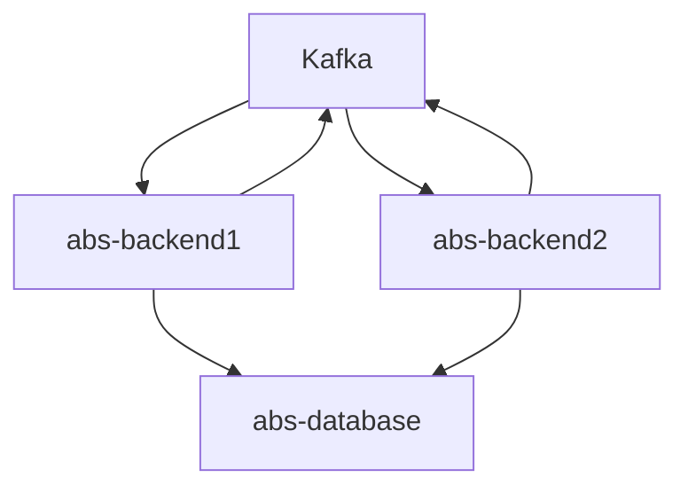

# abs-backend

Service responsible to do transaction between users. There are two different implementation of approach to maintain
transfer transaction.

1. Standalone approach with optimistic lock mechanism
2. Distributed approach with SAGA pattern

### Environment variables list

These environment variables necessary to run microservice with `prod` or `dev` profile

| variable name                      | description                              |
|:-----------------------------------|------------------------------------------|
| SERVER_PORT                        | Service server port                      |
| DATABASE_DIALECT                   | Database dialect                         |
| HIBERNATE_DDL_AUTO                 | Hibernate DDL mode                       |
| HIBERNATE_OPEN_IN_VIEW             | Hibernate open in view mode              |
| DATABASE_URL                       | Database url                             |
| DATABASE_USERNAME                  | Username to connect Database             |
| DATABASE_PASSWORD                  | Password to connect database             |
| DATABASE_PLATFORM                  | Database name                            |
| DATABASE_DRIVER_CLASS_NAME         | Database connection driver               |
| LIQUIBASE_SCHEMA                   | Liquibase tables schema                  |
| KAFKA_TRANSACTION_BOOTSTRAP_SERVER | Transaction feature kafka server address |
| KAFKA_TRANSACTION_TOPIC            | Transaction kafka topic                  |
| KAFKA_RETRY_BOOTSTRAP_SERVER       | Retry feature kafka server address       |
| KAFKA_RETRY_TOPIC                  | Retry kafka topic                        |
| KAFKA_TRANSACTION_CONSUMER_GROUP   | Transaction consumers group name         |
| KAFKA_RETRY_CONSUMER_GROUP         | Retry consumers group name               |
| TRANSACTION_TTL                    | Time to live of transaction              |
| IS_STANDALONE                      | Is standalone application ?              |
| TRANSACTION_RETRY_COUNT            | Transaction retry count                  |
| MONTH_OF_KEEPING_RECORDS           | Count of months with keeping records     |
| PARTITION_ENABLED                  | Flag to enable/disable partition         |
| PARTITION_CRON                     | Partition cron                           |
| LOG_LEVEL                          | Logging level                            |

### High level architecture of distributed approach

