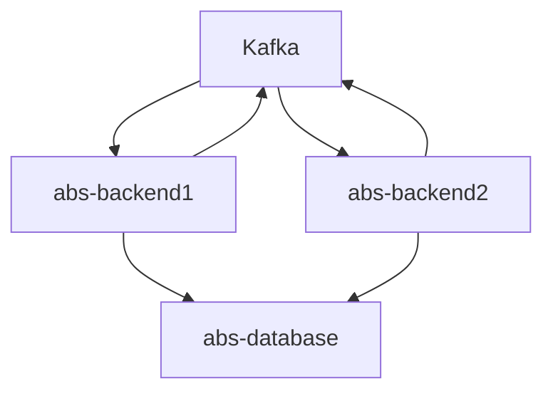

# ABS

Service responsible to do transaction between users. There are two different implementation of approach to maintain
transfer transaction.

1. Standalone approach with optimistic lock mechanism
2. Distributed approach with SAGA pattern

### High level architecture of distributed approach



## Steps to run:

Run this script
```shell
docker build -t abs .
```
Run docker compose
```shell
cd docker
docker compose up
```